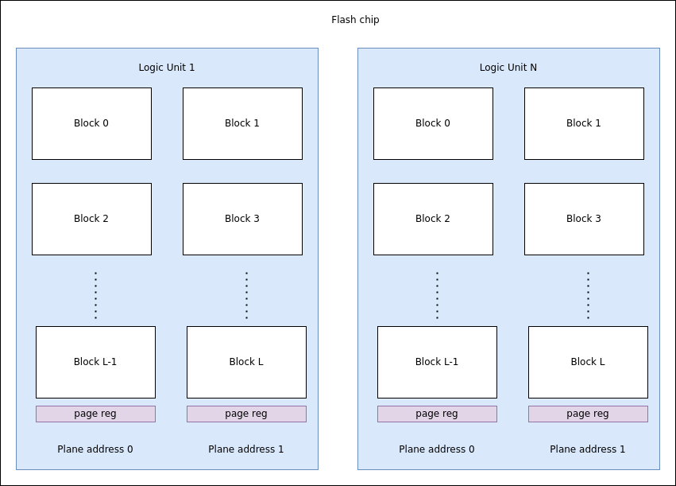
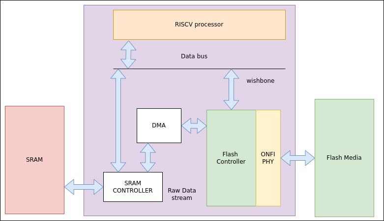

# ONFI MEMORY CONTROLLER
Flash memory has become the mainstream choice of storage for todays’ data driven world with increasing bit density and plays a crucial part in narrowing the gap between volatile and non-Volatile memories. ONFI is an open-source standard that provides vendor agnostic inter-operation between different
memory controllers and flash media.    
  
A flash memory is organized into many Logic Units as shown in the figure. Each Logic unit can contain 2 planes, each with a page register, and constitute of blocks, which are the smallest units of data, which can be erased at time in the flash memory. Each block contains pages, which are the smallest addressable units that can be programed or read at a time.  
.   

## Architecture
The ONFI memory controller is abstracted into PHY and MEM_CTRL, for the sake of modularity. The MEM CTRL host the command fifo, that allows for accepting and scheduling multiple commands from the host. The MEM_CTRL then send the necessary info into the PHY layer, which then drives the signals to the Flash media. 

## Host interface support
The ONFI compliant flash controller is designed to be integrated with a RISCV SoC, and the processor can configure and access all the registers using the Avilion Wishbone interface with single write and read accesses. A DMA interface is used to stream the Raw DATA that needs to be written or read from the flash media into the external SRAM. A data stream bus with valid/ready handshake is used initially. 
. 

## Nand Media Phy support
ONFI 1.0 uses an asynchronous SDR interface which has a theoritical max throughtput around 50 Mbytes per sec. It standardised the pin assignments and commands for the nand flash. ONFI 2.0 moved to synchronous interface NV-DDR(has a host driven clock), while still retaining the support for the legacy asynchronous mode. The throughput jumped to 133 MBps and 200 MBps in ONFI 2.1.  ONFI 2.2 and and ONFI 2.3 added the support for EZ-NAND interface. ONFI 3.x and 4.x shifted back to asynchronous interface NV-DDR2 and low voltage 1.2V NV-DDR3 respectively. The throughput increased upto 800 MBps in ONFI 3.x and upto 1200 MBps for ONFI 4.1. ONFI 5.0 added NV-LDDR4 data interface thats uses LTT electrical signalling with 1.2 V, and  a throughput of 2400 MBps. 

The target design has SDR support initially with considerations for scaling it up for latest ONFI specification compliance. The Pin assignment for various types of interfaces are listed in the table below.

|   SDR            |  NV-DDR         |   NV-DDR2/NV-DDR3  | NV-LPDDR4 |  Type | Description                |
| ---------------- | --------------- | ------------------ | --------- |  ---- |--------------------------- |
|   ALE            |  ALE            |   ALE              |  ALE      | Input | Address latch enable       |
|   CE_n           |  CE_n           |   CE_n             |  CE_n     | Input | Chip enable                | 
|   CLE            |  CLE            |   CLE              |  CLE      | Input | Command latch enable       |
|   I/O[7:0]       |  DQ[7:0]        |   DQ[7:0]          |  DQ[7:0]  | I/O   | Data inputs/outputs        |
|   —              |  DQS            |   DQS/DQS_t        |  DQS/DQS_t| I/O   | Data strobe                |
|   —              |  —              |   DQS_c            |  DQS_c    | I/O   | Data strobe complement     |
|   RE_n           |  W/R_n          |   RE_n/RE_t        |  RE_n/RE_t| Input | Read enable/(Write/Read_n direction)|
|   —              |  —              |   RE_c             |  RE_c     | Input | Read enable complement     |
|   WE_n           |  CLK            |   WE_n             |  WE_n     | Input | Write enable/Clock         |
|   WP_n           |  WP_n           |   WP_n             |  WP_n     | Input | Write protect              |
|   R/B_n          |  R/B_n          |   R/B_n            |  R/B_n    | Output| Ready / Busy_n             |
|   —              |  —              |   ZQ               |  ZQ       |  NA   | ZQ calibration             |
|   —              |  —              |   —                |  DBI      | I/O   | Data Bus Inversion         |
### SDR defined bus states
The SDR has the following bus states defined.  
|  CE_n            | ALE             | CLE                |WE_n       | RE_n  | SDR Bus State              |
| ---------------- | --------------- | ------------------ | --------- |  ---- |--------------------------- |
|  1               | X               |  X                 | X         | X     | Standby                    |
|  0               | 0               |  0                 | 1         | 1     | Idle                       |
|  0               | 0               |  1                 | 0         | 1     | Command cycle              |
|  0               | 1               |  0                 | 0         | 1     | Address cycle              |
|  0               | 0               |  0                 | 0         | 1     | Data input cycle           |
|  0               | 0               |  0                 | 1         | 0     | Data output cycle          |
|  0               | 1               |  1                 | X         | X     | Undefined                  |
## Make commands to run.
- `make lint` - runs lint tool with verilator
- `make sim_vivado/onfi_tb.v` - creates the simulation snapshot, compiles the verilog sources and run the simulation in vivado with waveform. 
All signals at the top level are already added.
- `make  sim/onfi_tb.fst` 
runs the simulations with icarus Verilog, and dumps the waveform file as onfi_tb.fst. You can use GTKwave to view the waveform.

